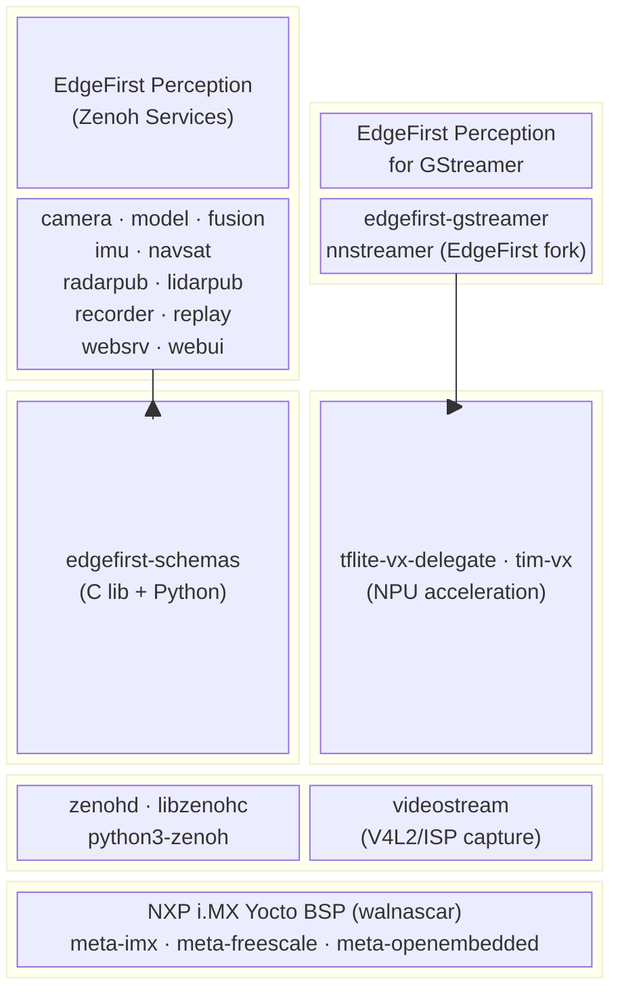

# meta-edgefirst

Yocto layer for the **EdgeFirst Perception Platform** targeting NXP i.MX processors.

meta-edgefirst provides the complete EdgeFirst ecosystem for embedded perception: Zenoh-based sensor services, NNStreamer/GStreamer ML inference pipelines, NPU-accelerated model execution, and supporting infrastructure. It is designed to work with the NXP i.MX Yocto BSP (walnascar release) and brings multi-sensor AI perception to i.MX8M Plus and i.MX93 platforms.

## Architecture



## Recipe Groups

### recipes-perception — Zenoh-Based Sensor Services

Standalone Zenoh-native services that publish, record, and replay sensor data. Each service runs as a systemd unit and communicates over the Zenoh protocol using EdgeFirst Schemas for message serialization.

| Recipe | GitHub Repository | Description |
|--------|-------------------|-------------|
| `edgefirst-camera` | [EdgeFirstAI/camera](https://github.com/EdgeFirstAI/camera) | Camera capture service — V4L2/ISP acquisition, Zenoh image publishing |
| `edgefirst-model` | [EdgeFirstAI/model](https://github.com/EdgeFirstAI/model) | Model inference service — NPU-accelerated object detection and classification |
| `edgefirst-fusion` | [EdgeFirstAI/fusion](https://github.com/EdgeFirstAI/fusion) | Sensor fusion service — radar-camera BEV fusion and occupancy grid |
| `edgefirst-imu` | [EdgeFirstAI/imu](https://github.com/EdgeFirstAI/imu) | IMU service — accelerometer/gyroscope data from I2C/SPI sensors |
| `edgefirst-navsat` | [EdgeFirstAI/navsat](https://github.com/EdgeFirstAI/navsat) | GNSS/GPS navigation satellite receiver service |
| `edgefirst-radarpub` | [EdgeFirstAI/radarpub](https://github.com/EdgeFirstAI/radarpub) | Radar publisher — automotive radar sensor data over Zenoh |
| `edgefirst-lidarpub` | [EdgeFirstAI/lidarpub](https://github.com/EdgeFirstAI/lidarpub) | LiDAR publisher — point cloud data from LiDAR sensors |
| `edgefirst-recorder` | [EdgeFirstAI/recorder](https://github.com/EdgeFirstAI/recorder) | Session recorder — captures Zenoh streams to disk for replay |
| `edgefirst-replay` | [EdgeFirstAI/replay](https://github.com/EdgeFirstAI/replay) | Session replay — replays recorded Zenoh sessions |
| `edgefirst-websrv` | [EdgeFirstAI/websrv](https://github.com/EdgeFirstAI/websrv) | Web UI backend server for EdgeFirst services |
| `edgefirst-webui` | [EdgeFirstAI/webui](https://github.com/EdgeFirstAI/webui) | Web dashboard for monitoring and configuring EdgeFirst services |
| `edgefirst-hal` | [EdgeFirstAI/hal](https://github.com/EdgeFirstAI/hal) | Hardware abstraction layer (C library + Python bindings) |
| `edgefirst-schemas` | [EdgeFirstAI/schemas](https://github.com/EdgeFirstAI/schemas) | Shared schema library (C + Python) for EdgeFirst message types |

### recipes-nnstreamer — ML Inference Pipelines

GStreamer/NNStreamer plugins for real-time ML inference on video and sensor streams.

| Recipe | GitHub Repository | Description |
|--------|-------------------|-------------|
| `edgefirst-gstreamer` | [EdgeFirstAI/gstreamer](https://github.com/EdgeFirstAI/gstreamer) | EdgeFirst Perception for GStreamer — Zenoh bridge elements, sensor fusion processing, HAL camera adaptor |
| `nnstreamer` | [EdgeFirstAI/nnstreamer](https://github.com/EdgeFirstAI/nnstreamer) | EdgeFirst fork of NNStreamer — adds dmabuf zero-copy, TFLite-VX CameraAdaptor, Ara-2 sub-filter support |

### recipes-extensions — NPU Acceleration Libraries

Bbappend files for NXP ML libraries, pulling EdgeFirstAI forks with optimizations and fixes for the i.MX NPU (Neural Processing Unit).

| Recipe | GitHub Repository | Description |
|--------|-------------------|-------------|
| `tim-vx` | [EdgeFirstAI/tim-vx](https://github.com/EdgeFirstAI/tim-vx) | Tensor Interface Module for OpenVX — NPU graph compiler interface |
| `tflite-vx-delegate` | [EdgeFirstAI/tflite-vx-delegate](https://github.com/EdgeFirstAI/tflite-vx-delegate) | TFLite delegate for VeriSilicon NPU — routes TFLite operations to the NPU via TIM-VX |

### recipes-support — Supporting Infrastructure

Core infrastructure services and libraries required by the perception and GStreamer stacks.

| Recipe | GitHub Repository | Description |
|--------|-------------------|-------------|
| `zenoh` | [eclipse-zenoh/zenoh](https://github.com/eclipse-zenoh/zenoh) | Zenoh router daemon (zenohd), libzenohc, and python3-zenoh bindings |
| `videostream` | [EdgeFirstAI/videostream](https://github.com/EdgeFirstAI/videostream) | V4L2/ISP video capture library with DMA-BUF support for zero-copy pipelines |

## Packagegroups

All EdgeFirst packages are managed by a single `packagegroup-edgefirst` recipe with sub-packages:

| Package | Description |
|---------|-------------|
| `packagegroup-edgefirst` | Shared infrastructure — zenoh-c, edgefirst-schemas, edgefirst-hal, videostream |
| `packagegroup-edgefirst-zenoh` | Zenoh sensor services — zenohd, camera, model, fusion, imu, navsat, radarpub, lidarpub, recorder, replay, websrv, webui |
| `packagegroup-edgefirst-gstreamer` | GStreamer/NNStreamer ML inference pipelines — edgefirst-gstreamer |
| `packagegroup-edgefirst-python` | Python bindings — python3-zenoh, edgefirst-schemas-python, edgefirst-hal-python |

### packagegroup-edgefirst-sdk

SDK toolchain sysroot packages for cross-compilation (separate recipe).

**Includes:** videostream-dev, zenoh-c-dev, zenoh-c-staticdev, edgefirst-schemas-dev, edgefirst-schemas-staticdev, edgefirst-hal-dev, edgefirst-hal-staticdev

## Dependencies

This layer requires the following layers from the NXP i.MX Yocto BSP (walnascar release):

| Layer | Repository | Purpose |
|-------|-----------|---------|
| `meta-imx` | [nxp-imx/meta-imx](https://github.com/nxp-imx/meta-imx) | NXP i.MX BSP — kernel, firmware, GPU/VPU drivers |
| `meta-imx-ml` | [nxp-imx/meta-imx](https://github.com/nxp-imx/meta-imx) | NXP ML libraries — TensorFlow Lite, TIM-VX, ONNX Runtime |
| `openembedded-core` | [openembedded/openembedded-core](https://github.com/openembedded/openembedded-core) | Core Yocto/OE recipes |
| `meta-openembedded` | [openembedded/meta-openembedded](https://github.com/openembedded/meta-openembedded) | Additional OE layers (meta-oe, meta-python, meta-networking) |

## Setup

### Adding the layer to your NXP BSP build

1. Clone meta-edgefirst into your BSP sources directory:

```bash
cd sources/
git clone https://github.com/EdgeFirstAI/meta-edgefirst.git
```

2. Add the layer to your `bblayers.conf`:

```bash
bitbake-layers add-layer sources/meta-edgefirst
```

Or manually add to `conf/bblayers.conf`:

```
BBLAYERS += "${BSPDIR}/sources/meta-edgefirst"
```

3. Verify the layer is recognized:

```bash
bitbake-layers show-layers
```

### Adding EdgeFirst packages to your image

Add a packagegroup to your image recipe or `local.conf`:

```
# Zenoh perception services (includes shared infrastructure)
IMAGE_INSTALL:append = " packagegroup-edgefirst-zenoh"

# Python bindings (optional)
IMAGE_INSTALL:append = " packagegroup-edgefirst-python"

# GStreamer ML inference pipelines (planned)
IMAGE_INSTALL:append = " packagegroup-edgefirst-gstreamer"
```

Or install individual packages:

```
IMAGE_INSTALL:append = " edgefirst-camera edgefirst-schemas zenohd"
```

## Development Roadmap

meta-edgefirst is being developed incrementally as EdgeFirst repositories are published as open source. The layer will be built out in phases:

**Phase 1 — Foundation** (current)
- Layer structure, configuration, packagegroup skeletons
- README documentation

**Phase 2 — Supporting Infrastructure**
- zenohd, libzenohc, python3-zenoh recipes
- videostream recipe
- edgefirst-schemas recipe (C library + Python wheel)

**Phase 3 — Perception Services**
- edgefirst-camera, edgefirst-imu, edgefirst-navsat
- edgefirst-radarpub, edgefirst-lidarpub
- edgefirst-model, edgefirst-fusion
- edgefirst-recorder, edgefirst-replay
- edgefirst-websrv, edgefirst-webui

**Phase 4 — ML/GStreamer Pipeline**
- NNStreamer EdgeFirst fork (dmabuf, TFLite-VX CameraAdaptor, Ara-2 sub-filter)
- gst-edgefirst plugins
- tim-vx and tflite-vx-delegate bbappends

## License

This layer is licensed under the [Apache License 2.0](LICENSE).

Individual recipe packages may have their own licenses — see each recipe's `LICENSE` variable for details.
